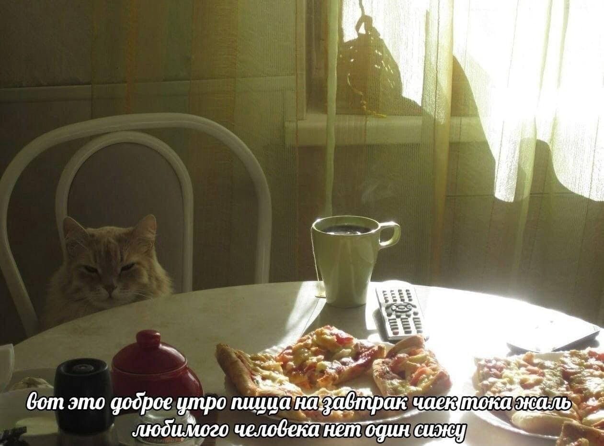
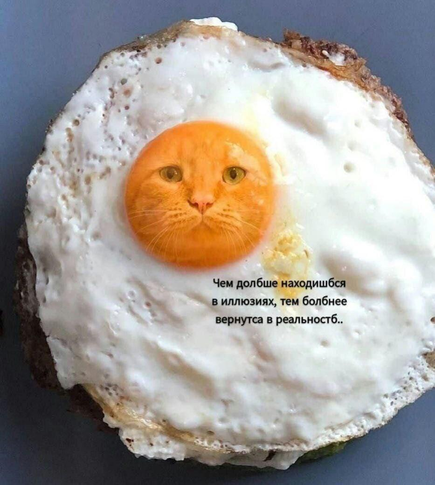

# Прогресс по проекту

## Задача:

обучить модель, генерирующую хорошие и подробные описания мемов (задача Image Captioning)

## Данные

### Описания мемов

Были скачаны данные из групп вк textmeme и badtextmeme, лежат [тут](data/memes). 
К моему сожалению, получилось очень мало пар картинка-текст (~3500). 

Примеры описаний:

1. На фото котик сидит за обеденным столом на стуле. Перед ним стоит свежезаваренный чай и лежат куски пиццы на тарелках. Подпись: "вот это доброе утро пицца на завтрак чаёк тока жаль любимого человека нет один сижу"



2. На фотографии яичница. На желтке изображена полупрозрачная морда кота. Он смотрит на читателя мема. Подпись: "Чем долбше находишбся в иллюзиях, тем болбнее вернутса в реальностб.."




Если кратко описывать данные - то это пары картинка-текст, где картинки - это мемы 
(фото, фото с подписями и просто скрины текстов/постов), а текст - довольно подробное описание картинки, 
включающее в себя описание происходящего на фото/картинке, а также подписи. Описания не очень длинные, 
но длиннее, чем в классических датасетах, и они не обязательно состоят из одного предложения. 


### Дополнительные данные

В связи с тем, что данных с описаниями мемов оказалось крайне мало, я начала искать варианты 
схожих датасетов, и у меня не удалось найти для русского языка датасетов с парами картинка-текст.

Возможно, для чего-то очень сильно предобученного мой 
маленький датасет сгодится в качестве дообучения, но было принято решение
перевести какие-нибудь данные с английского. Выбор пал на [Flickr30k](https://www.kaggle.com/datasets/hsankesara/flickr-image-dataset), 
я не искала сложных путей и просто перевела предложения на русский 
в Google Sheets, где используется Google Translate. 
Всего было переведено 47220 предложений, которые соответствовали картинкам. 

Еще хотела скачать картинки из датасета Conceptual captions, 
так как перевела таким же образом валидационную часть датасета (около ~16k картинок). 
Но картинки по ссылкам скачивались очень долго, из-за чего от этой идеи пришлось отказаться.

Уже после обучения первого бейзлайна удалось найти еще один хороший датасет на английском языке, 
подходящий для моей задачи даже больше, чем предыдущие, - это
[VizWiz](https://vizwiz.org/tasks-and-datasets/image-captioning/). Это также датасет с парами картинка-текст,
но он состоит из фото, которые были сделаны людьми с нарушением зрения, а описания составлены таким образом, чтобы объяснить такому человеку происходящее на картинке.
Другими словами, датасет содержит более подробные описания, чем Flickr или COCO и другие схожие датасеты.
Я скачала обучающую и валидационную части этого датасета, и перевела их. В валидационной части получилось 
~33500 пар, а в обучающей - . Этот датасет использовался для обучения второго безйлайна.

Стоит отметить, что перевод описаний не идеален - там бывают ошибки различного рода, например, грамматические.
Однако, на мое субъективное мнение, полученные описания неплохи, к тому же, у меня не было особо другого выбора.

## Метрики

В качесте метрик оценки моделей были выбраны BLEU-1,  BLEU-2,  BLEU-3,  BLEU-4 и METEOR. 
(BLEU отлючаются между собой по кол-ву n-грамм, которые сравниваются).

## Обучение моделей

В целом, задача Image Captioning обычно решается с помощью архитектуры Encoder-Decoder, где encoder кодирует 
представление картинки, а decoder пытается раскодировать его в описание этой самой картинки.

### Baseline 1: ResNet-50 + LSTM

В качестве простой бейзлайновой модели выбрала связку ResNet-50 + LSTM, код написан по примеру 
[отсюда](https://github.com/sauravraghuvanshi/Udacity-Computer-Vision-Nanodegree-Program/tree/master/project_2_image_captioning_project)
и его можно увидеть [здесь](src/baseline/train_baseline.py). ResNet взят предобученным и не дообучается в процессе обучения модели.


Данные токенизировались с помощью nltk.word_tokenize и приводились к нижнему регистру. Одно описание картинки - одна последовательность,
максимальная длина = 100 слов. В случае, если последовательность длиннее - она обрезается до 100 слов, если короче - дополняется паддингами.

Обучались только эмбеддинги слов, батч-нормализация в encoder и сам decoder. 
Скрытая размерность LSTM=512, размер эмбеддингов картинки и текста=512. В качестве функции потерь
использовалась кросс-энтропия, оптимизатор для обноваления весов функции - Adam с параметрами lr=0.001, betas=(0.9, 0.999), eps=1e-08.
После каждого bask-propagation использовался клиппинг градиентов по норме до 5.

Во-первых, сначала модель в течение 30 эпох обучалась на ~16k данных flickr. 
Затем в течение следуюших 40 эпох обучалась на ~2450 данных мемов. 
Тут сразу хочется сказать, что я не ожидала, что оно будет обучаться до конца на мемах
(если в течение 10 эпох модель не улучшала bleu-3, она бы оставновила обучение). 
Но bleu-3 все улучшалось и улучшалось понемногу, 
а модель все переобучалась и переобучалась. И в конце, все пришло к тому,
что она генерировала полуразумные описания, которые оставались такими до тех пор, 
пока не сравнишь с референсом и с картинкой - 
на самом деле описания модели это были перемешенные куски предложений из тренировочного датасета, 
никак не связанные с описанной картинкой. Получилось грустно, но видимо ожидаемо. 
А небольшое повышение bleu на каждом новом шаге обучения на мемах возможно можно объяснить тем, что
модель выучила общие паттерны описаний - такие как "на фото", "подпись: " и т.д., 
которые встречаются почти в каждом описании.

### Baseline 2: ResNet-101 + LSTM

Код для обучения: [здесь](src/baseline/train_baseline2.py)

Захотелось постараться исправить безйлайн хоть как-то прежде чем переходить к каким-то более сложным моделям. 
Что было исправлено:

1) Добавлено кол-во данных для обучения: использовался весь (переведенный) flickr - в трейне ~33k пар картинка-текст. К тому же, добавились данные VizWiz -  в трейне было ~102k пар.
2) Добавлены предобученные эмбеддинги (которые подавались на вход в лстм, раньше инициализировались рандомно) - взяла 
эмбеддинги из библиотеки navec (размерность 300) [отсюда](https://github.com/natasha/navec). В связи с этим, уменьшена размерность эмбеддингов картинки и текста, подаваемых на вход в LSTM до 300.
3) Увеличен кодировщик картинки с ResNet-50 до ResNet-101.
4) Увеличен дропаут в LSTM с 0.2 до 0.5
5) так же 30 эпох преобучаю сеть на переведенных данных Flickr + VizWiz, затем - максимум 20 эпох на мемах
6) (не очень значительно, но) убрала токены \<start> и \<end>, потому что в процессе переписывания кода поняла, что они, кажется, бессмысленны здесь. Остались только специальные токены \<unk> и \<pad>.

По итогу взяла для измерения результата на тесте модель, которая обучалась 40 эпох (30 на переведенных данных + 10 на мемах).

Метрики для первой модели: 

+ BLEU-1: 0.2365403455258041
+ BLEU-2: 0.12524633005192543
+ BLEU-3: 0.06832267182572499
+ BLEU-4: 0.044314753279022984
+ METEOR: 0.1684054109175605

Для второй:

+ BLEU-1: 0.21990098367306515
+ BLEU-2: 0.08810229805671885
+ BLEU-3: 0.03410863712744984
+ BLEU-4: 0.01606359135546614
+ METEOR: 0.09981684981684982

Но я бы не сказала, что первая на самом деле лучше второй - первая очень переобучена и генерирует описания, собранные из кусочков обучающих данных,
вторая же - просто какой-то бессвязный бред. На самом деле, в моих данных есть еще одна огромная проблема - 
в предобучении нет картинок с текстом на русском языке, только на мемах модель очевидно не сможет выучить распознование букв. 
Так что с подписями на русском она никак не справляется. Помимо этого, перевод не идеален, так что хорошему русскому языку она не выучится на предобучении.
И, наверное, архитектура модели простовата для такой задачи. А данных с описаниями, по типу которых я хочу получать генерацию,
слишком мало. 

**Вот пример генерации второй модели :** (для понимания того, что я имею под бредом)

```
подпись : `` плетеной меньшим одну специей пельмени своего монитора '' . , ниже фотография с заглядывает трое с довольным лицом . `` во рту кончиками . . . роз — подпись : `` с днём крайне сделать сильнее '' . на втором кадре та же голова людей с упаковкой плиточной
```

**а вот референсное предложение:**
``` 
шаблон мема с накаченной и обычной собаками сиба-ину. слева кот, но с накаченным человеческим телом под цвет шерсти, а также с мечом за спиной и короной на голове. справа кот, но обычный. подписи слева, рядом с накаченным котом: "уличный кот", "я подерусь с бандой енотов, чтобы защитить свою честь". подписи справа, рядом с обычным котом: "домашний кот", "я попил молока и меня вырвало тебе на кровать".
```

То есть, в целом, модель выучивает шаблоны (но хотя бы в данном случае не целые фразы) из тренировочных данных, но реально мем описать не может.


### Что дальше?


Дальше, хочу все-таки попробовать использовать предобученные модели и надеюсь получить хоть немного адекватные результаты.

Пока цель - использовать идею из статьи [ClipCap: CLIP Prefix for Image Captioning](https://arxiv.org/abs/2111.09734). 
Основная идея - если есть предобученная модель CLIP и предобученная генеративная сеть, можем взять их и натренировать лишь
небольшую сетку MLP между ними - CLIP кодирует картинку, MLP как-то меняет эмбеддинг картинки и передает на вход 
генеративной сети, например, GPT, которая уже генерирует описание. На самом деле, авторы там рассказывают про несколько подходов к обучению такой связки:
обучение простой сетки можно заменить на обучение более сложной сети с вниманием, и можно дообучать/не дообучать GPT -
я скорее пойду по пути наименьшего расхода памяти и времени обучения, но если успею, может попробую разные варинты. 

Насчет самих моделей, у сбера как раз есть предобученный [ruCLIP](https://github.com/ai-forever/ru-clip) и [ruGPT](https://github.com/ai-forever/ru-gpts),
их и возьму. На самом деле, у меня даже есть почти готовый код для такого обучения [здесь](src/clip_model/train.py), надо лишь еще немного его поправить.


Есть еще один вариант, который я тоже немного попробовала уже запустить - это дообучить сберовский [RuDOLPH](https://github.com/ai-forever/ru-dolph) - 
большую модель мультимодальную модель, обученную выполнять множество задач, связанных с текстами и картинками. Одна 
из таких задач как раз Image Captioning, у них даже есть туториал по дообучению модели на для этой задачи. Но с первого раза
запустить у меня это не вышло, так как даже с батчем размера 1 память переполняется очень быстро и все падает (а это в колабе, где она больше, чем у меня на ноутбуке, на котором я обучаю модели).
Если получится разобраться в чем дело и хватит времени, попробую дообучить эту модель.
